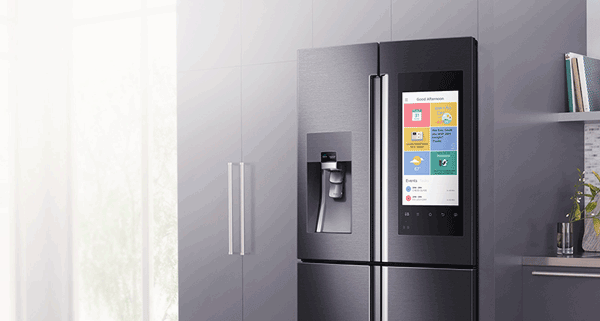

# Mise en application

## Situation-problème à exposer : le frigo

  

Toi et tes amies voulez lancer sur le marché un frigo "intelligent". Il est fabriqué, reste à le programmer.

### Contenu du frigo

```js 

let frigo = [
{name:"Coca-Cola", type: "boisson", stateInPercent: 85},
{name:"Jus de Pommes", type: "boisson", stateInPercent: 100 },
{name:"Jus de Pommes Bio", type: "boisson", stateInPercent: 100 },
{name:"Confiture de Fraise Materne", type: "nourriture", stateInPercent: 0 },
{name:"Sandwich", type: "nourriture", stateInPercent: 10 },
{name:"Sandwich", type: "nourriture", stateInPercent: 100 },
{name:"Saucisson", type: "nourriture", stateInPercent: 23 },
{name:"Laitue bio", type: "nourriture", stateInPercent: 100 },
{name:"Boite de 10 Oeufs bio", type: "nourriture", stateInPercent: 60 },
{name:"Nurofen Enfants", type: "medicament", stateInPercent: 78 }
];

```

**Explique comment tu résoudrais les problèmes suivants. A chaque fois, décris comment tu stockes les données et ensuite fournis du pseudocode répondant au problème.**

1. Afficher tout ce qu'il y a dans le frigo dans une liste html
1. Afficher une liste html de ce qu'il faut acheter pour remplacer ce qui est entamé
2. Afficher la réponse à une question du type : "combien d'oeufs reste-t-il?" 
1. Suggérer des recettes sur base de ce qui est disponible actuellement dans le frigo (tu as accès à un API externe, acceptant une liste d'ingrédients et retournant une ou plusieurs recettes utilisant ces ingrédients. L'API permet de spécifier s'il faut avoir tous les ingrédients ou si elle peut retourner des recettes impliquant de compléter ce qu'on a déjà).
2. Sur base de ces exercices, as-tu ressenti le besoin de repenser / améliorer la structure de données ? Si oui, comment ?

